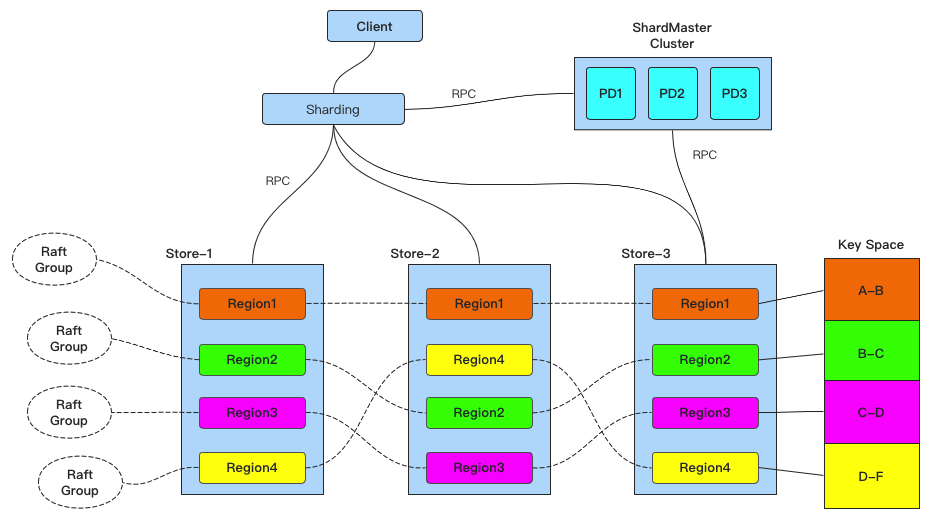

### 简介
一个 Go 实现的内存版分布式一致性 KV 服务器。

## 原理概述
### Raft
  假设我们的系统有一个常用的 KV server，但是考虑到网络的不可靠性和大量机器在一起时的故障率，一般的 KV server 无法保证可靠的容灾。
  这时我们的一个方法是多副本节点容灾，但是又因为 `CAP` 理论的限制，这里存在一个一致性的问题。`Raft` 理论解决了这个一致性问题。

  Raft 是一个基于状态机的强领导的一致性算法，它将所有请求视为 `Log Entry`
  一旦一个集群 `Log Entry` 成功，该 `Log Entry` 便会成为集群共识，保证对外提供可靠服务。
#### Raft 层实现
  本部分代码主要位于 `src/raft` 目录，其一个 `Raft Group` 的基本流程可见图一
 - `Raft` 使用了 `Leader` 处理所有请求，如何选取出合适的 `Leader`，可见 `RequestVote RPC`；
 - `Client` 的请求会被 `Leader` 分发给其他的节点，如何进行分发和同步可见`AppendEntries RPC`;
 - 这些 `Log Entry` 需要进行持久化，以保证服务重启也可以使用，这个需要在服务发生状态变更的时候进行 `doPersit`；
 - 当长时间服务的时候，`Log Entry` 会增长到难以忍受的地步，这就需要实现 `SnapShot` 机制，让数据自动移除不必要的部分。

### RaftKV
 本部分代码主要位于 `src/kvraft` 目录
 - Raft 层已经实现了可靠的 `Raft` 集群功能，本部分将抽离出 `DB` 类，结合 `Raft` 层实现一个 DB `Raft-Group`;
 - 由于网络的不可靠，出现乱序、超时和正在选举的情况下， server 可能会收到两次相同的历史请求。这就需要实现 `linearizable semantics`，使得每台client发出的请求序列均满足线性一致性;
 - 当 Server 长期运行时，各个节点的 `Raft Log` 可能会增长得非常大，会耗费过大的存储资源，故节点应该在特定的时候，进行 `InstallSnapshot`。

### Multi-Raft
 本部分代码主要位于 `src/shardmaster` 和 `src/shardkv`
 单个 `Raft-Group` 在服务请求逐步增大时，会面临如下问题：
 - 单机的存储容量限制了系统的存储容量；
 - 请求量进一步提升时，单机无法处理这些请求（读写请求都由Leader节点处理）。
#### Multi-Raft 原理:
  <!-- `Multi-Raft` 解决了以上问题。 -->
  为了容纳逐步增大的服务请求，`Multi-Raft` 创建了若干个 `Raft-Group` 将整个系统请求均匀分摊到这些 `Raft-Group` 中。
  而为了管理这些 `Raft-Group`，`Multi-Raft`又引入了 `SharedMaster` 集群来专门进行管理，他们的关系如下图:
 
#### MultiRaft 需要解决的一些核心问题：
 - 请求如何分片；
 - 分片的调度，让负载在系统中更平均（分片副本的迁移，补全，Leader 切换等等）；
 - 分片中的数据越来越大，需要分裂产生更多的分片，如何使该系统保证具有可伸缩性；
 - 系统添加或者移除 `Raft-Group` 时，如何进行在线数据迁移；
 - 如何处理 stale 的请求（例如 Proposal 和 Apply 的时候，当前的副本不是 Leader、分裂了、被销毁了等等）。

## Reference
 1. [raft 在线动画演示](http://www.kailing.pub/raft/index.html)
 2. [raft 中英文论文](https://github.com/maemual/raft-zh_cn)
 3. [raft 作者博士论文](https://web.stanford.edu/~ouster/cgi-bin/papers/OngaroPhD.pdf)
 4. [Raft 的优化](https://pingcap.com/zh/blog/optimizing-raft-in-tikv)
 5. [Raft 的应用与优化](https://codeantenna.com/a/skgtzCiILK)
 6. [Multi-Raft在TiKV中的实践](https://blog.51cto.com/u_15703183/5449815)
