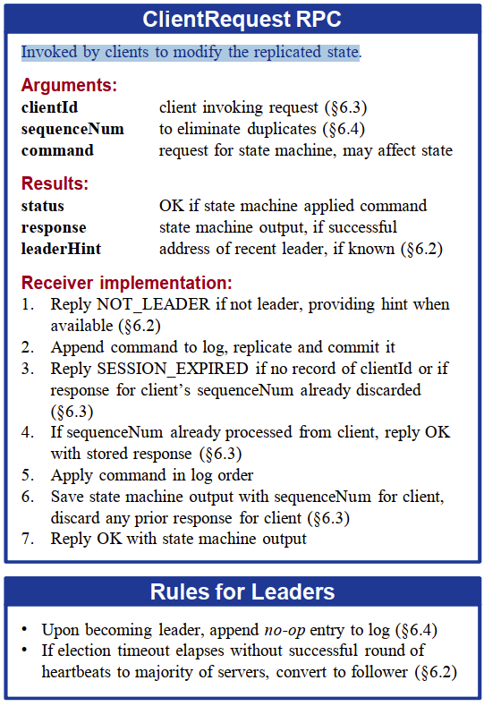
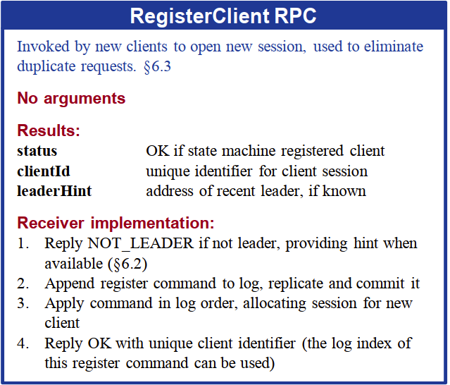
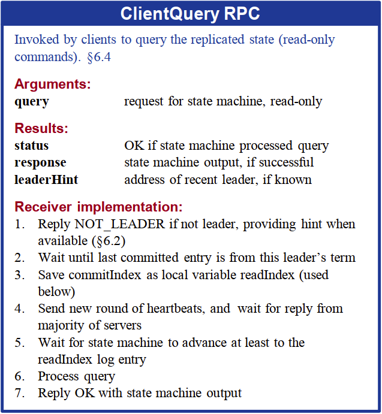

##  - Spring 2020

# 6.824 Lab 3: Fault-tolerant Key/Value Service

### Due Part A: Apr 3 23:59

### Due Part B: Apr 17 23:59

------

### Introduction

In this lab you will build a fault-tolerant key/value storage service using your Raft library from [lab 2](http://nil.csail.mit.edu/6.824/2020/labs/lab-raft.html). Your key/value service will be a replicated state machine, consisting of several key/value servers that use Raft for replication. Your key/value service should continue to process client requests as long as a majority of the servers are alive and can communicate, in spite of other failures or network partitions.

服务支持的操作`Put(Key, Value)`, `Append(key, arg)`,和 `Get(key)`。
`Put(Key)`替换数据库中的key，
`Append(key, arg)`append arg to key's value

`Clerk`管理与服务器的交互
<!-- The service supports three operations: `Put(key, value)`, `Append(key, arg)`, and `Get(key)`. It maintains a simple database of key/value pairs. Keys and values are strings. `Put()` replaces the value for a particular key in the database, `Append(key, arg)` appends arg to key's value, and `Get()` fetches the current value for a key. A `Get` for a non-existant key should return an empty string. An `Append` to a non-existant key should act like `Put`. Each client talks to the service through a `Clerk` with Put/Append/Get methods. A `Clerk` manages RPC interactions with the servers. -->

Your service must provide strong consistency to application calls to the `Clerk` Get/Put/Append methods. Here's what we mean by strong consistency. If called one at a time, the Get/Put/Append methods should act as if the system had only one copy of its state, and each call should observe the modifications to the state implied by the preceding sequence of calls. For concurrent calls, the return values and final state must be the same as if the operations had executed one at a time in some order. Calls are concurrent if they overlap in time, for example if client X calls `Clerk.Put()`, then client Y calls `Clerk.Append()`, and then client X's call returns. Furthermore, a call must observe the effects of all calls that have completed before the call starts (so we are technically asking for linearizability).

Strong consistency is convenient for applications because it means that, informally, all clients see the same state and they all see the latest state. Providing strong consistency is relatively easy for a single server. It is harder if the service is replicated, since all servers must choose the same execution order for concurrent requests, and must avoid replying to clients using state that isn't up to date.

This lab has two parts. In part A, you will implement the service without worrying that the Raft log can grow without bound. In part B, you will implement snapshots (Section 7 in the paper), which will allow Raft to discard old log entries. Please submit each part by the respective deadline.

You should reread the [extended Raft paper](http://nil.csail.mit.edu/6.824/2020/papers/raft-extended.pdf), in particular Sections 7 and 8. For a wider perspective, have a look at Chubby, Paxos Made Live, Spanner, Zookeeper, Harp, Viewstamped Replication, and [Bolosky et al.](http://static.usenix.org/event/nsdi11/tech/full_papers/Bolosky.pdf)

Start early.

### Collaboration Policy

You must write all the code you hand in for 6.824, except for code that we give you as part of the assignment. You are not allowed to look at anyone else's solution, you are not allowed to look at code from previous years, and you are not allowed to look at other Raft implementations. You may discuss the assignments with other students, but you may not look at or copy each others' code.

Please do not publish your code or make it available to current or future 6.824 students. `github.com` repositories are public by default, so please don't put your code there unless you make the repository private. You may find it convenient to use [MIT's GitHub](https://github.mit.edu/), but be sure to create a private repository.

### Getting Started

We supply you with skeleton code and tests in `src/kvraft`. You will need to modify `kvraft/client.go`, `kvraft/server.go`, and perhaps `kvraft/common.go`.

To get up and running, execute the following commands. Don't forget the `git pull` to get the latest software.

```shell
$ cd ~/6.824
$ git pull
...
$ cd src/kvraft
$ go test
...
$
```

### Part A: Key/value service without log compaction

Each of your key/value servers ("kvservers") will have an associated Raft peer.

 Clerks 发送 `Put()`, `Append()`, and `Get()` RPCs to the kvserver whose associated Raft is the leader.
 kvserver code 提交Put/Append/Get 操作给 Raft, so that the Raft log holds a sequence of Put/Append/Get operations.
 所有kvservers执行 Raft的log操作 operations from the Raft log in order, applying the operations to their key/value databases; the intent is for the servers to maintain identical replicas of the key/value database.

`Cleark`
A `Clerk` sometimes doesn't know which kvserver is the Raft leader. If the `Clerk` sends an RPC to the wrong kvserver, or if it cannot reach the kvserver, the `Clerk` should re-try by sending to a different kvserver. If the key/value service commits the operation to its Raft log (and hence applies the operation to the key/value state machine), the leader reports the result to the `Clerk` by responding to its RPC. If the operation failed to commit (for example, if the leader was replaced), the server reports an error, and the `Clerk` retries with a different server.

Your kvservers should not directly communicate; they should only interact with each other through Raft. For all parts of Lab 3, you must make sure that your Raft implementation continues to pass all of the Lab 2 tests.

Your first task is to implement a solution that works when there are no dropped messages, and no failed servers.

You'll need to add RPC-sending code to the Clerk Put/Append/Get methods in `client.go`, and implement `PutAppend()` and `Get()` RPC handlers in `server.go`. These handlers should enter an `Op` in the Raft log using `Start()`; you should fill in the `Op` struct definition in `server.go` so that it describes a Put/Append/Get operation. Each server should execute `Op` commands as Raft commits them, i.e. as they appear on the `applyCh`. An RPC handler should notice when Raft commits its `Op`, and then reply to the RPC.

You have completed this task when you **reliably** pass the first test in the test suite: "One client".

- After calling `Start()`, your kvservers will need to wait for Raft to complete agreement. Commands that have been agreed upon arrive on the `applyCh`. Your code will need to keep reading `applyCh` while `PutAppend()` and `Get()` handlers submit commands to the Raft log using `Start()`. Beware of deadlock between the kvserver and its Raft library.
- You are allowed to add fields to the Raft `ApplyMsg`, and to add fields to Raft RPCs such as `AppendEntries`.
- A kvserver should not complete a `Get()` RPC if it is not part of a majority (so that it does not serve stale data). A simple solution is to enter every `Get()` (as well as each `Put()` and `Append()`) in the Raft log. You don't have to implement the optimization for read-only operations that is described in Section 8.
- It's best to add locking from the start because the need to avoid deadlocks sometimes affects overall code design. Check that your code is race-free using `go test -race`.

Now you should modify your solution to continue in the face of network and server failures. One problem you'll face is that a `Clerk` may have to send an RPC multiple times until it finds a kvserver that replies positively. If a leader fails just after committing an entry to the Raft log, the `Clerk` may not receive a reply, and thus may re-send the request to another leader. Each call to `Clerk.Put()` or `Clerk.Append()` should result in just a single execution, so you will have to ensure that the re-send doesn't result in the servers executing the request twice.

Add code to handle failures, and to cope with duplicate `Clerk` requests, including situations where the `Clerk` sends a request to a kvserver leader in one term, times out waiting for a reply, and re-sends the request to a new leader in another term. The request should execute just once. Your code should pass the `go test -run 3A` tests.

- 解决方案应该处理一个领导调用了 `Start()` 对一个Cleark's RPC, 但在请求提交之后丢失了它的领导权。In this case you should arrange for the Clerk to re-send the request to other servers until it finds the new leader. One way to do this is for the server to detect that it has lost leadership, by noticing that a different request has appeared at the index returned by Start(), or that Raft's term has changed. If the ex-leader is partitioned by itself, it won't know about new leaders; but any client in the same partition won't be able to talk to a new leader either, so it's OK in this case for the server and client to wait indefinitely until the partition heals.
- You will probably have to modify your Clerk to remember which server turned out to be the leader for the last RPC, and send the next RPC to that server first. This will avoid wasting time searching for the leader on every RPC, which may help you pass some of the tests quickly enough.
- You will need to uniquely identify client operations to ensure that the key/value service executes each one just once.
- Your scheme for duplicate detection should free server memory quickly, for example by having each RPC imply that the client has seen the reply for its previous RPC. It's OK to assume that a client will make only one call into a Clerk at a time.

Your code should now pass the Lab 3A tests, like this:

```shell
$ go test -run 3A
Test: one client (3A) ...
  ... Passed --  15.1  5 12882 2587
Test: many clients (3A) ...
  ... Passed --  15.3  5  9678 3666
Test: unreliable net, many clients (3A) ...
  ... Passed --  17.1  5  4306 1002
Test: concurrent append to same key, unreliable (3A) ...
  ... Passed --   0.8  3   128   52
Test: progress in majority (3A) ...
  ... Passed --   0.9  5    58    2
Test: no progress in minority (3A) ...
  ... Passed --   1.0  5    54    3
Test: completion after heal (3A) ...
  ... Passed --   1.0  5    59    3
Test: partitions, one client (3A) ...
  ... Passed --  22.6  5 10576 2548
Test: partitions, many clients (3A) ...
  ... Passed --  22.4  5  8404 3291
Test: restarts, one client (3A) ...
  ... Passed --  19.7  5 13978 2821
Test: restarts, many clients (3A) ...
  ... Passed --  19.2  5 10498 4027
Test: unreliable net, restarts, many clients (3A) ...
  ... Passed --  20.5  5  4618  997
Test: restarts, partitions, many clients (3A) ...
  ... Passed --  26.2  5  9816 3907
Test: unreliable net, restarts, partitions, many clients (3A) ...
  ... Passed --  29.0  5  3641  708
Test: unreliable net, restarts, partitions, many clients, linearizability checks (3A) ...
  ... Passed --  26.5  7 10199  997
PASS
ok      kvraft  237.352s
```

The numbers after each `Passed` are real time in seconds, number of peers, number of RPCs sent (including client RPCs), and number of key/value operations executed (`Clerk` Get/Put/Append calls).


### Part B: Key/value service with log compaction

As things stand now with your code, a rebooting server replays the complete Raft log in order to restore its state. However, it's not practical for a long-running server to remember the complete Raft log forever. Instead, you'll modify Raft and kvserver to cooperate to save space: from time to time kvserver will persistently store a "snapshot" of its current state, and Raft will discard log entries that precede the snapshot. When a server restarts (or falls far behind the leader and must catch up), the server first installs a snapshot and then replays log entries from after the point at which the snapshot was created. Section 7 of the [extended Raft paper](http://nil.csail.mit.edu/6.824/2020/papers/raft-extended.pdf) outlines the scheme; you will have to design the details.

You must design an interface between your Raft library and your service that allows your Raft library to discard log entries. You must revise your Raft code to operate while storing only the tail of the log. Raft should discard old log entries in a way that allows the Go garbage collector to free and re-use the memory; this requires that there be no reachable references (pointers) to the discarded log entries.

The tester passes `maxraftstate` to your `StartKVServer()`. `maxraftstate` indicates the maximum allowed size of your persistent Raft state in bytes (including the log, but not including snapshots). You should compare `maxraftstate` to `persister.RaftStateSize()`. Whenever your key/value server detects that the Raft state size is approaching this threshold, it should save a snapshot, and tell the Raft library that it has snapshotted, so that Raft can discard old log entries. If `maxraftstate` is -1, you do not have to snapshot. `maxraftstate` applies to the GOB-encoded bytes your Raft passes to `persister.SaveRaftState()`.

Modify your Raft so that it can be given a log index, discard the entries before that index, and continue operating while storing only log entries after that index. Make sure all the Lab 2 Raft tests still succeed.

Modify your kvserver so that it detects when the persisted Raft state grows too large, and then hands a snapshot to Raft and tells Raft that it can discard old log entries. Raft should save each snapshot with persister.SaveStateAndSnapshot() (don't use files). A kvserver instance should restore the snapshot from the persister when it re-starts.

- Think about when a kvserver should snapshot its state and what should be included in the snapshot. Raft must store each snapshot in the persister object using `SaveStateAndSnapshot()`, along with corresponding Raft state. You can read the latest stored snapshot using `ReadSnapshot()`.
- Your kvserver must be able to detect duplicated operations in the log across checkpoints, so any state you are using to detect them must be included in the snapshots.
- Capitalize all fields of structures stored in the snapshot.
- You are allowed to add methods to your Raft so that kvserver can manage the process of trimming the Raft log and manage kvserver snapshots.

Modify your Raft leader code to send an InstallSnapshot RPC to a follower when the leader has discarded log entries that the follower needs. When a follower receives an InstallSnapshot RPC, it must hand the included snapshot to its kvserver. You can use the `applyCh` for this purpose, by adding new fields to `ApplyMsg`. Your solution is complete when it passes all of the Lab 3 tests.

- Send the entire snapshot in a single InstallSnapshot RPC. Don't implement Figure 13's `offset` mechanism for splitting up the snapshot.
- Make sure you pass `TestSnapshotRPC` before moving on to the other Snapshot tests.
- A reasonable amount of time to take for the Lab 3 tests is 400 seconds of real time and 700 seconds of CPU time. Further, `go test -run TestSnapshotSize` should take less than 20 seconds of real time.

3B test:

```shell
$ go test -run 3B
Test: InstallSnapshot RPC (3B) ...
  ... Passed --   1.5  3   163   63
Test: snapshot size is reasonable (3B) ...
  ... Passed --   0.4  3  2407  800
Test: restarts, snapshots, one client (3B) ...
  ... Passed --  19.2  5 123372 24718
Test: restarts, snapshots, many clients (3B) ...
  ... Passed --  18.9  5 127387 58305
Test: unreliable net, snapshots, many clients (3B) ...
  ... Passed --  16.3  5  4485 1053
Test: unreliable net, restarts, snapshots, many clients (3B) ...
  ... Passed --  20.7  5  4802 1005
Test: unreliable net, restarts, partitions, snapshots, many clients (3B) ...
  ... Passed --  27.1  5  3281  535
Test: unreliable net, restarts, partitions, snapshots, many clients, linearizability checks (3B) ...
  ... Passed --  25.0  7 11344  748

PASS
ok      kvraft  129.114s
```







